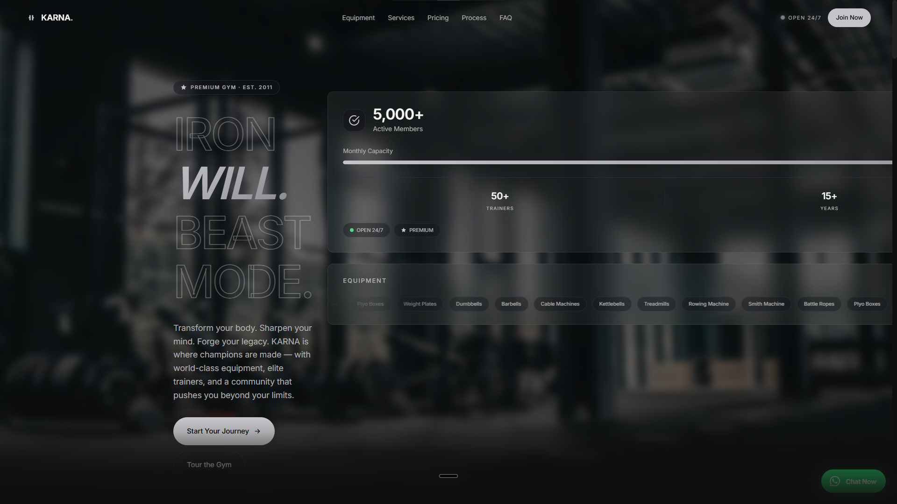
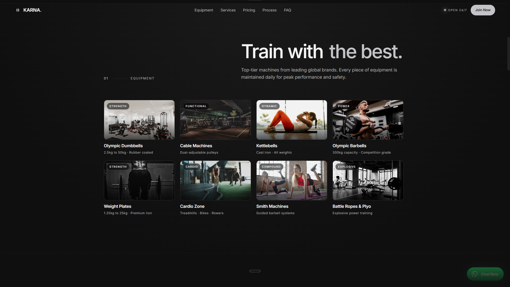
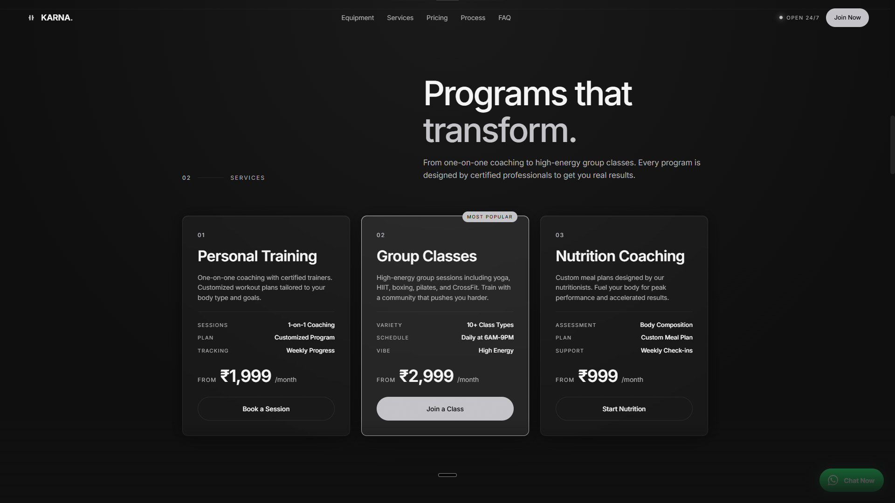
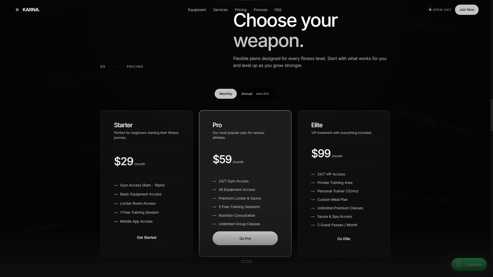
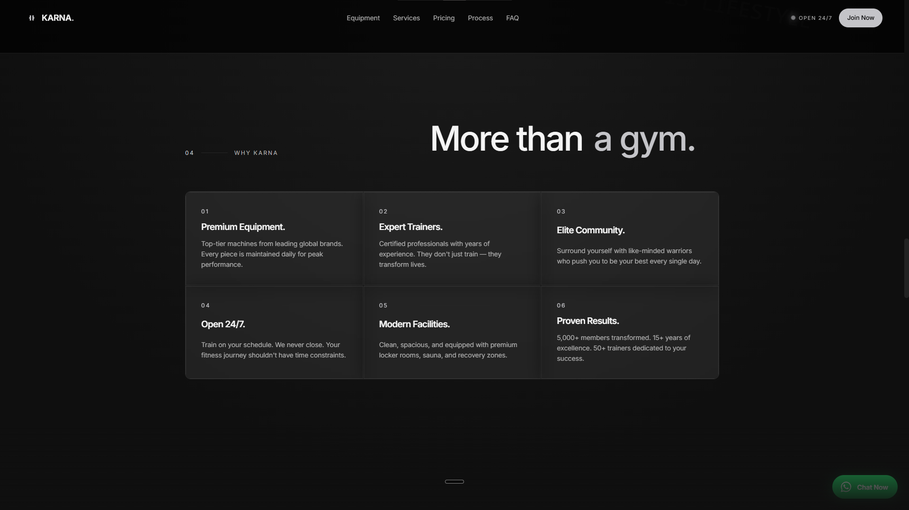
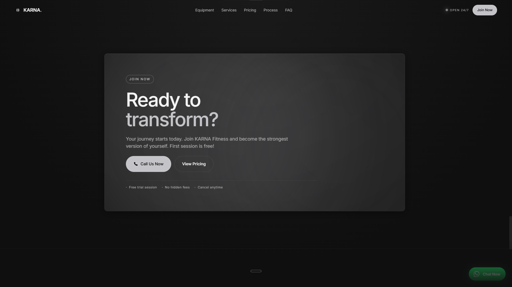

---
# KARNA — Premium Fitness Gym

A dark, bold landing page for a fitness gym that doesn't do subtle.

🔗 **Live:** [REPLACE_WITH_ACTUAL_URL]

## Preview


*The hero section featuring the "IRON WILL. BEAST MODE." brand statement against a near-black full-viewport background, with a stat card showing 5,000+ active members and an 82% capacity fill.*


*The equipment gallery showcasing Olympic dumbbells, cable machines, kettlebells, treadmills, and a Smith machine — each card with a category tag and lazy-loaded image.*


*The services section with station cards for Personal Training, Group Classes, and Nutrition Coaching — each with spec lists and per-month pricing in INR.*


*The pricing section displaying three membership tiers — Starter ($29/mo), Pro ($59/mo), and Elite ($99/mo) — with a Monthly/Annual toggle switch.*


*The "Why KARNA" features section with six numbered cards highlighting premium equipment, expert trainers, elite community, 24/7 access, modern facilities, and proven results.*


*The call-to-action section with WhatsApp click-to-chat as the primary contact method, featuring a phone icon and "Call Us Now" button against a dark gradient.*

## About

I wanted to build something that actually felt like walking into a gym at 6 AM before the sun's up — dark, a little intense, no soft pastel wellness-app vibes. Most gym websites lean into bright, friendly, "everyone's welcome" energy, which is fine, but KARNA is built for people who already know why they're there. The whole site leans on a near-black theme with sharp typography and restrained motion, so the few animations that do exist (the section reveals, the FAQ accordion) actually land instead of getting lost in a sea of bouncing elements.

## What's on the page

- **Hero** — full-viewport intro with the brand statement and a direct CTA, no scrolling required to know what the site is about
- **Programs/Training** — what KARNA actually offers, laid out so it's skimmable in ten seconds
- **Equipment** — a quick rundown of what's in the gym, because people genuinely check this before joining
- **Pricing** — membership tiers, kept simple, no asterisks-and-fine-print games
- **Testimonials** — real-format member quotes to break up the pitch with actual voices
- **FAQ** — an accordion built with native `<details>`/`<summary>`, each item staggered in with its own reveal delay so they don't all pop in at once
- **Footer/Contact** — WhatsApp click-to-chat as the primary contact method, plus email and address

## Built with


- Plain HTML, CSS and vanilla JavaScript — no framework, no build step
- `IntersectionObserver` for scroll-triggered reveal animations instead of a scroll event listener, so it's not recalculating on every pixel of scroll
- A single self-invoking script handles nav state, the mobile menu, and the reveal logic — kept small on purpose

## Why I built it this way

I went back and forth on whether to keep a custom mouse-follow glow effect that was originally on the hero section — it looked nice on a big desktop screen, but it added a `mousemove` listener running on every frame, and on anything less than a high-end laptop it started to feel like unnecessary weight for what's ultimately a marketing page, not a portfolio piece. I ended up stripping it out in favor of keeping things fast and letting the typography and dark contrast do the work instead. Same logic went into ditching a contact form for the footer — for a gym, especially one trying to feel local and personal, a WhatsApp link that opens a pre-filled message gets someone talking to a real person in two taps, instead of filling a form and waiting for a reply that might come a day later.

The FAQ accordion uses native `<details>`/`<summary>` elements rather than a custom JS-built dropdown — it's less code, it's accessible by default (keyboard and screen readers just work), and the only JavaScript needed is for the staggered reveal-in animation, not for the open/close behavior itself.

## Running it locally

```
karna/
├── index.html
├── css/
│ └── style.css
├── js/
│ └── script.js
└── assets/  
```
No build tools, no dependencies. Just open `index.html` in a browser, or run a local server if you want (`npx serve` works fine).

## Status

This is a demo/concept build — contact details, address, and testimonials are illustrative, not a real business.